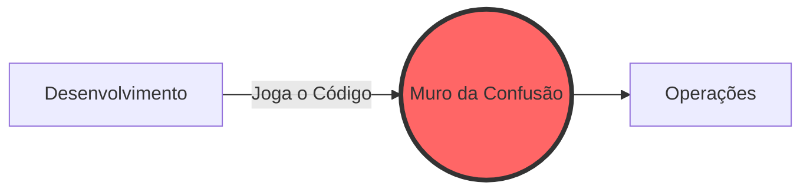
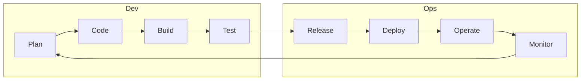

# Aula 01 - Introdução ao DevOps e Cultura ♾️

!!! tip "Objetivo"
    **Objetivo**: Compreender o que é o movimento DevOps, sua origem cultural e como ele resolve os conflitos históricos entre times de Desenvolvimento (Dev) e Operações (Ops).

---

## 1. O que é DevOps? 🤔

DevOps não é apenas um cargo ou uma ferramenta. É uma **cultura** e uma série de práticas que unem o **Desenvolvimento de Software (Dev)** e as **Operações de TI (Ops)**.

O objetivo principal é encurtar o ciclo de vida de desenvolvimento do sistema e fornecer entrega contínua com alta qualidade de software.

### 🏢 O Modelo Tradicional (Silos)
Antigamente, os times trabalhavam de forma isolada (em "silos"):
-   **Desenvolvimento**: Focado em criar novas funcionalidades rapidamente.
-   **Operações**: Focado em manter a estabilidade do sistema e evitar mudanças que pudessem causar erros.

Isso gerava o famoso **"Muro da Confusão"**, onde o Dev "jogava" o código por cima do muro e o Ops tinha que se virar para fazê-lo rodar.

---

## 2. O Muro da Confusão 🧱

### Problemas do modelo tradicional:
*   **Lentidão**: Deploy demorado e burocrático.
*   **Conflitos**: Acusações mútuas quando algo quebra ("Na minha máquina funciona!").
*   **Baixa Qualidade**: Bugs descobertos apenas em produção.

---

## 3. Os 3 Pilares do DevOps 🏗️

O DevOps se sustenta em três pilares fundamentais:

1.  **Cultura**: Colaboração, confiança e responsabilidade compartilhada.
2.  **Processos**: Automação de tarefas repetitivas e feedback rápido.
3.  **Ferramentas**: Tecnologias que facilitam a integração e o monitoramento.

### O Ciclo de Vida DevOps (O Infinito)

---

## 4. Benefícios Práticos 🚀

*   **Velocidade**: Entregas mais frequentes.
*   **Confiabilidade**: Menos erros em produção devido à automação.
*   **Escalabilidade**: Capacidade de gerenciar sistemas complexos com menos esforço.
*   **Colaboração**: Times trabalham juntos por um objetivo comum: o valor para o cliente.

---

## 5. Visão Geral de Ferramentas 🛠️

Embora o DevOps seja cultura, as ferramentas são o que "lubrificam" as engrenagens:

-   **Versionamento**: Git, GitHub, GitLab.
-   **CI/CD**: GitHub Actions, Jenkins, CircleCI.
-   **Containers**: Docker, Kubernetes.
-   **Cloud**: AWS, Azure, Google Cloud.
-   **Monitoramento**: Prometheus, Grafana.

---

## 6. Prática Inicial 💻

Antes de começarmos a codar, precisamos entender o ambiente:

1.  **Terminal**: Sua maior ferramenta de agora em diante.
2.  **Conta no GitHub**: Onde seu código viverá e será automatizado.
3.  **Mentalidade**: Esteja pronto para aprender que "software pronto" é "software rodando bem para o usuário".

---

## 7. Exercício de Reflexão 🧠

Pense sobre um site ou app que você usa e que "caiu" ou parou de funcionar recentemente.

1.  Como essa falha poderia ter sido evitada com melhor comunicação entre quem cria e quem mantém o app?
2.  Em sua opinião, qual o maior desafio para dois times diferentes trabalharem juntos?

---

**Próxima Aula**: Vamos explorar as metodologias que deram origem ao DevOps na aula de [Cultura Ágil](./aula-02.md)! 🏗️

