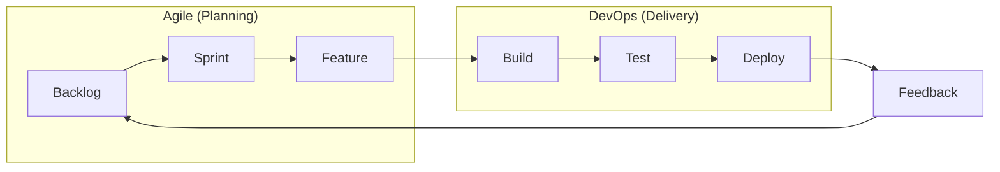

# Aula 02 - Cultura Ágil e DevOps 🏃‍♂️

!!! tip "Objetivo"
    **Objetivo**: Entender a relação intrínseca entre o DevOps e as metodologias ágeis, explorando como o Scrum e o Manifesto Ágil pavimentaram o caminho para a entrega contínua.

---

## 1. Por que Ágil? 🌪️

Antes do **Manifesto Ágil (2001)**, o software era desenvolvido no modelo **Cascata (Waterfall)**:
1.  Requisitos (meses)
2.  Design (meses)
3.  Desenvolvimento (meses)
4.  Testes (meses)
5.  Entrega (após 1 ano ou mais)

**O Problema**: Quando o software chegava ao cliente, o mundo já tinha mudado ou as necessidades eram outras.

---

## 2. O Manifesto Ágil 📜

O Agile não é um conjunto de regras, mas 4 valores fundamentais:

*   **Indivíduos e interações** mais que processos e ferramentas.
*   **Software em funcionamento** mais que documentação abrangente.
*   **Colaboração com o cliente** mais que negociação de contratos.
*   **Responder a mudanças** mais que seguir um plano.

### Introdução ao Agile Alliance
A [Agile Alliance](https://www.agilealliance.org/) é uma organização sem fins lucrativos que promove esses valores globalmente. No DevOps, bebemos dessa fonte para garantir que a automação sirva às pessoas, e não o contrário.

---

## 3. DevOps e Scrum 🔄

O **Scrum** é o framework ágil mais utilizado. O DevOps estende os benefícios do Scrum para além do desenvolvimento.

| Scrum (Foco no Dev) | DevOps (Foco no Ciclo Todo) |
| :--- | :--- |
| Sprints (Iterações) | Deploy Contínuo |
| Daily Meetings | Feedback em Tempo Real |
| Product Backlog | Infraestrutura como Código |
| Incremento de Software | Software Rodando em Produção |

### Scrum.org e DevOps
A [Scrum.org](https://www.scrum.org/) oferece capacitação que integra as práticas de desenvolvimento com a entrega de software. O DevOps é o "braço técnico" que permite ao Scrum entregar valor em cada Sprint.

---

## 4. Conceito de Entrega Contínua (Continuous Delivery) 🏗️

A entrega contínua é a capacidade de colocar alterações de qualquer tipo (novas funcionalidades, configurações, correções de bugs) em produção de forma **segura**, **rápida** e **sustentável**.

### Os 3 pilares da Entrega Contínua:
1.  **Baixo Risco**: Deploys pequenos e frequentes são menos perigosos que um grande deploy anual.
2.  **Automação**: Se você faz algo mais de duas vezes, automatize!
3.  **Qualidade**: O software deve estar sempre em um estado "implantável" (deployable).

---

## 5. Visualizando o Fluxo Ágil-DevOps 🌊

---

## 6. Prática Inicial 🛠️

Para ser ágil, você precisa de visibilidade. No mundo DevOps, usamos ferramentas de gestão como:
*   **GitHub Projects**: Para organizar tarefas (To Do, Doing, Done).
*   **Trello / Jira**: Para fluxos mais complexos.

**Sua tarefa**: Pense em um projeto simples (ex: criar um site pessoal). Divida ele em 3 tarefas pequenas que possam ser feitas em 1 hora cada. Isso é desconstruir em partes ágeis!

---

## 7. Exercício de Fixação 🧠

1.  Explique com suas palavras a diferença entre o modelo Cascata e o Ágil.
2.  Como a prática de DevOps ajuda um time a ser verdadeiramente ágil?
3.  O que significa dizer que um software deve estar sempre em estado "deploiável"?

---

**Próxima Aula**: Vamos aprender a ferramenta base de qualquer DevOps: o [Git Essencial](./aula-03.md)! 📡

