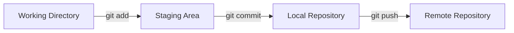

# Aula 03 - Controle de Versão com Git 📜

!!! tip "Objetivo"
    **Objetivo**: Compreender o conceito de versionamento de código, aprender os comandos fundamentais do Git e entender como ele permite que múltiplos desenvolvedores trabalhem no mesmo projeto sem caos.

---

## 1. O que é Versionamento? 🕰️

Imagine que você está escrevendo um TCC. Você salva como `TCC_final.docx`, depois `TCC_final_v2.docx`, depois `TCC_final_agora_vai.docx`. 

O **Controle de Versão** (VCS) resolve isso de forma profissional, permitindo que você:
*   Mantenha um histórico de todas as alterações.
*   Volte no tempo se algo quebrar.
*   Trabalhe em equipe sem sobrescrever o trabalho do colega.

O **Git** é o sistema de controle de versão distribuído mais popular do mundo.

---

## 2. A Estrutura do Git (Os 3 Estados) 🏗️

O Git trabalha com três áreas principais:

1.  **Working Directory**: Onde você edita seus arquivos.
2.  **Staging Area (Index)**: Onde você marca os arquivos que quer salvar no próximo "print" (commit).
3.  **Repository (.git)**: Onde o Git guarda permanentemente as fotos (snapshots) do seu código.



---

## 3. Comandos Básicos (Mão na Massa) 🛠️

Abra seu terminal e prepare-se para usar os comandos sagrados:

### Iniciando um Projeto
```termynal
$ git init
# Inicia um repositório Git na pasta atual.
```

### Verificando o Status
```termynal
$ git status
# Diz quem foi modificado e quem está pronto para o commit.
```

### Preparando e Salvando
```termynal
$ git add arquivo.txt
# Move o arquivo para a Staging Area (pode usar 'git add .' para todos).

$ git commit -m "Explicação clara do que foi mudado"
# Salva a alteração com uma mensagem.
```

---

## 4. Branches: Linhas do Tempo 🌿

Uma **Branch** é uma ramificação do seu projeto. Você pode criar uma branch para testar uma funcionalidade nova sem estragar a versão principal (`main`).

*   `git branch`: Lista as branches.
*   `git checkout -b nova-feature`: Cria e muda para uma nova branch.
*   `git merge nova-feature`: Junta as alterações da branch na `main`.

---

## 5. Boas Práticas de Commits 📝

Um bom desenvolvedor DevOps escreve mensagens de commit que fazem sentido:
*   ❌ `git commit -m "ajuste"`
*   ❌ `git commit -m "foi"`
*   ✅ `git commit -m "Adiciona validação de e-mail no formulário de login"`

**Dica**: Use o presente e seja descritivo: "Adiciona X", "Corrige Y", "Remove Z".

---

## 6. Prática Sugerida 💻

1.  Crie uma pasta chamada `meu-primeiro-git`.
2.  Inicie o git nela (`git init`).
3.  Crie um arquivo `index.html`.
4.  Adicione e commite (`git add .` e `git commit`).
5.  Crie uma branch chamada `ajuste-texto`, mude o arquivo e faça o merge.

---

## 7. Exercício de Fixação 🧠

1.  Qual a diferença entre a Staging Area e o Repositório Local?
2.  Para que serve o comando `git merge`?
3.  Por que é importante usar uma branch diferente para cada nova funcionalidade?

---

**Próxima Aula**: Vamos levar nosso código para o mundo com o [GitHub Colaborativo](./aula-04.md)! 👥

