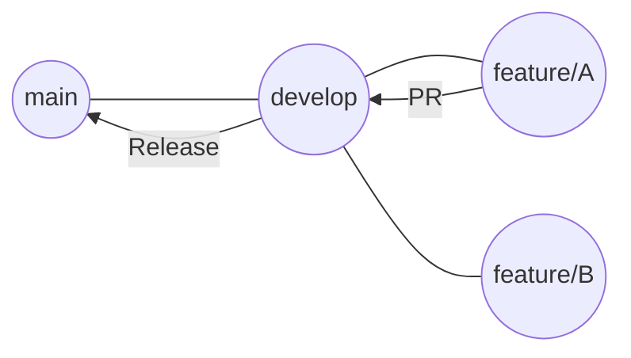

# Aula 04 - Repositórios Remotos e GitHub 👥

!!! tip "Objetivo"
    **Objetivo**: Entender o papel do GitHub como plataforma de colaboração, aprender a trabalhar com repositórios remotos, dominar o fluxo de Pull Requests e o Git Flow simplificado.

---

## 1. O que é o GitHub? ☁️

Enquanto o Git é o software que controla as versões na sua máquina, o **GitHub** é um serviço de nuvem que hospeda esses repositórios. Pense nele como uma "Rede Social para Programadores", mas com ferramentas poderosas de automação.

### Por que usar?
*   **Backup**: Seu código está seguro na nuvem.
*   **Colaboração**: Muitos desenvolvedores podem contribuir no mesmo projeto.
*   **Portfólio**: Uma vitrine para empresas verem o que você sabe fazer.
*   **Automação (DevOps)**: Onde os pipelines de CI/CD (GitHub Actions) acontecem.

---

## 2. Trabalhando com Remotos 📡

Para conectar seu Git local ao GitHub, usamos os comandos de "sincronização":

*   `git remote add origin [URL]`: Conecta sua pasta local a um repositório no GitHub.
*   `git push -u origin main`: Envia seus commits locais para o GitHub.
*   `git pull`: Traz as novidades que seus colegas enviaram para o GitHub.
*   `git clone [URL]`: Baixa um projeto inteiro para sua máquina.

---

## 3. Fluxo de Trabalho: Pull Requests (PR) 📥

No DevOps, nunca enviamos código diretamente para a branch prinicipal (`main`) sem revisão. Usamos o fluxo de **Pull Request**:

1.  Você cria uma **Branch** para sua tarefa (`feature-login`).
2.  Faz os commits e o **Push**.
3.  No GitHub, você abre um **Pull Request**.
4.  Seus colegas revisam seu código, fazem comentários e sugerem mudanças.
5.  Quando tudo estiver OK, o código é "mergeado" na `main`.

---

## 4. Git Flow Simplificado 🌊

O Git Flow é uma estratégia de organização de branches. Para iniciantes, usamos este modelo simples:

*   **main**: Código estável que está rodando para o usuário (em "produção").
*   **develop**: Onde as funcionalidades novas são integradas antes de irem para a main.
*   **features/**: Branches temporárias para criar algo novo (ex: `feature/ajuste-fonte`).

---

## 5. Colaboração Profissional 🤝

*   **Issues**: Para relatar bugs ou pedir novas funcionalidades.
*   **Code Review**: O ato de ler o código do colega para garantir qualidade e aprender.
*   **README.md**: O arquivo mais importante! Explica o que o projeto faz e como rodar.

---

## 6. Prática Sugerida 🚀

1.  Crie um repositório público no seu GitHub chamado `lab-devops-01`.
2.  Suba os arquivos que criamos na aula anterior (`git push`).
3.  Crie um arquivo chamado `README.md` direto pelo site do GitHub.
4.  Dê um `git pull` na sua máquina para ver o arquivo aparecer lá.
5.  Crie uma branch, mude algo e abra seu primeiro **Pull Request** para você mesmo.

---

## 7. Exercício de Fixação 🧠

1.  Diferencie Git de GitHub.
2.  O que é um Pull Request e por que ele é vital para a cultura DevOps?
3.  Qual o comando para baixar um repositório existente do GitHub pela primeira vez?

---

**Fim do Módulo 1!** Você agora entende a cultura e a base técnica. No próximo módulo, iniciaremos a **Integração Contínua e Automação**! ⚙️
