# Aula 06 - Entrega Contínua (CD) 🚚

!!! tip "Objetivo"
    **Objetivo**: Compreender a diferença entre Entrega Contínua (Continuous Delivery) e Implantação Contínua (Continuous Deployment), e entender como o código sai do repositório e chega ao ambiente de produção.

---

## 1. O que é Entrega Contínua (CD)? 📦

Se o CI é sobre *integrar* código, o **CD** é sobre *entregar* esse código. 

Existem duas variações do CD:

*   **Continuous Delivery (Entrega Contínua)**: O pipeline automatiza todo o processo de deploy, mas a decisão final de "apertar o botão" e colocar no ar é **humana**. É o modelo mais comum em empresas grandes.
*   **Continuous Deployment (Implantação Contínua)**: Todo commit que passa nos testes de CI vai **automaticamente** para produção, sem intervenção humana. Exige altíssima confiança nos testes.

---

## 2. O Pipeline de CD 🏗️

O CD começa onde o CI termina. Após a geração do artefato:

```mermaid
graph LR
    Artifact(["Artefato"]) --> Staging(["Ambiente de Homologação"])
    Staging --> Manual(["Aprovação Humana"])
    Manual --> Prod(["Ambiente de Produção"])
```

### Automação de CD (Termynal) 💻

git push origin main
Build... OK
Testes... OK
Aguardando aprovação para Produção...
approve-deploy --env prod
Deploying to AWS...

Status: Site Online! 🚀

1.  **Staging (Homologação)**: Um ambiente idêntico ao real onde o time testa a nova versão.
2.  **Testes de Aceitação**: Testes automatizados (end-to-end) que simulam o usuário final.
3.  **Deploy em Produção**: A atualização final do sistema para os usuários reais.

---

## 3. Estratégias de Deploy 🛡️

Para evitar que o sistema fique fora do ar durante a atualização, usamos estratégias como:

*   **Blue-Green Deployment**: Você tem dois ambientes idênticos. O "Green" está no ar. Você sobe a versão nova no "Blue". Se tudo estiver ok, você vira a chave do roteador para o "Blue".
*   **Canary Release**: Você libera a versão nova para apenas 5% dos usuários. Se não houver erros, libera para o restante.
*   **Rolling Update**: Atualiza um servidor por vez, gradualmente, até que todos estejam na versão nova.

---

## 4. O papel da Infraestrutura como Código (IaC) 💻

No CD moderno, não configuramos servidores clicando em janelas. Usamos código para descrever a infraestrutura. Isso garante que o ambiente de teste seja **exatamente igual** ao de produção.

---

## 5. Prática Sugerida: Deploy no GitHub Pages 🚀

Um exemplo simples de CD é o que estamos fazendo neste curso!
Sempre que fazemos um push para a branch `main`, o GitHub Actions:
1.  Gera o site (MkDocs).
2.  Publica automaticamente na internet (GitHub Pages).

Este é um exemplo de **Continuous Deployment**.

---

## 6. Exercício de Fixação 🧠

1.  Explique a diferença entre Continuous Delivery e Continuous Deployment.
2.  O que é um ambiente de "Staging" e por que ele é crucial?
3.  Qual a vantagem da estratégia "Canary" em comparação com atualizar todos os servidores de uma vez?

---

**Próxima Aula**: Como garantimos que o código rode exatamente igual na minha máquina e no servidor? Vamos entrar no mundo dos [Containers e Virtualização](./aula-07.md)! 🐳
