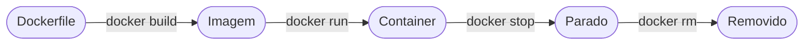

# Aula 08 - Docker na Prática 🚀

!!! tip "Objetivo"
    **Objetivo**: Aprender os comandos essenciais do Docker, construir sua primeira imagem personalizada e rodar um container conectando portas e volumes.

---

## 1. Instalando o Docker 🛠️

Para começar, você precisa do **Docker Desktop** (Acesse [docker.com](https://www.docker.com/)). 

Após instalado, abra o terminal e digite:
```bash
docker --version
```

---

## 2. Comandos Básicos do Dia a Dia ⌨️

*   `docker images`: Lista as imagens que você tem baixadas no PC.

### Ciclo de Comandos Docker



### Prática: Build e Run (Termynal) 💻

<div id="termynal" data-termynal markdown>
<span data-ty="input">docker build -t meu-site .</span>
<span data-ty>Sending build context... OK</span>
<span data-ty>Step 1/3 : FROM nginx:alpine...</span>
<span data-ty>Successfully tagged meu-site:latest</span>
<span data-ty="input">docker run -d -p 8080:80 meu-site</span>
<span data-ty>f1a2b3c4d5e6...</span>
<span data-ty>Status: Container rodando em localhost:8080! 🚀</span>
</div>

---

## 3. Criando sua Própria Imagem (Dockerfile) 📝

Imagine que temos um arquivo `index.html`. Queremos criar uma imagem que já venha com um servidor web e nossa página dentro.

Crie um arquivo chamado `Dockerfile` (sem extensão):

```dockerfile
# 1. Definir a imagem base
FROM nginx:alpine

# 2. Copiar os arquivos do seu PC para dentro da imagem
COPY index.html /usr/share/nginx/html/index.html

# 3. Informar qual porta o container vai usar
EXPOSE 80
```

Para gerar a imagem, use:
```bash
docker build -t meu-site-docker .
```

---

## 4. Portas e Mapeamento 🚪

Por padrão, um container é isolado. Para acessá-lo do seu navegador, você precisa mapear uma porta do seu PC para a porta dele.

```bash
docker run -d -p 8080:80 meu-site-docker
```
*   `-d`: Roda em "background" (você continua usando o terminal).
*   `-p 8080:80`: Mapeia a porta **8080** do seu computador para a porta **80** do container.

Agora, acesse `localhost:8080` no seu navegador! 🎉

---

## 5. Persistência de Dados (Volumes) 💾

Se você apagar um container de banco de dados, os dados somem. Os **Volumes** permitem que o container escreva dados diretamente em uma pasta do seu computador, garantindo que eles não se percam.

---

## 6. Exercício de Fixação 🧠

1.  Qual a diferença entre `docker run` e `docker start`?
2.  O que o comando `docker build` faz exatamente?
3.  Se mapearmos a porta `-p 3000:80`, qual endereço devemos digitar no navegador para acessar a aplicação?

---

**Próxima Aula**: Concluímos o Módulo 2! Agora vamos para as nuvens. [Módulo 3: Fundamentos de Cloud Computing](./aula-09.md) ☁️
