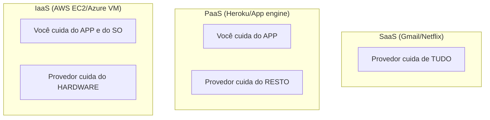

# Aula 09 - Fundamentos de Cloud Computing ☁️

!!! tip "Objetivo"
    **Objetivo**: Entender o que é Computação em Nuvem, quais são seus principais modelos (IaaS, PaaS, SaaS) e por que ela é a base de quase todos os sistemas modernos.

---

## 1. O que é "A Nuvem"? 🤔

Muitas pessoas pensam que a nuvem é algo abstrato, mas o ditado popular no TI diz: *"A nuvem é apenas o computador de outra pessoa"*.

A Computação em Nuvem é a entrega de recursos de TI (processamento, armazenamento, bancos de dados) sob demanda, via internet, com pagamento por uso.

---

## 2. Benefícios da Nuvem 💎

*   **Custo**: Você não precisa comprar servidores caros. Você "aluga" e paga só pelo que usa.
*   **Escalabilidade**: Seu site cresceu? Em segundos você aumenta a capacidade.
*   **Elasticidade**: O tráfego diminuiu de madrugada? A nuvem reduz os recursos automaticamente para economizar.
*   **Globalidade**: Você pode colocar seu site para rodar em um servidor no Japão com apenas um clique.

---

## 3. Modelos de Serviço (O Triângulo da Cloud) 📐

A nuvem é dividida em três camadas principais:

3.  **SaaS (Software como Serviço)**: Você usa o software pronto via navegador. Ex: Gmail, Google Drive, Netflix.

### Modelo de Responsabilidade Compartilhada

### Explorando a Nuvem (Termynal) 💻

aws ec2 describe-instances --region us-east-1
Fetching instances...

{ "Instances": [ { "InstanceId": "i-0987654321", "State": "running" } ] }
Status: 1 servidor rodando na Virgínia! ☁️

---

## 4. Modelos de Implantação 🏠

*   **Nuvem Pública**: Os recursos são compartilhados por várias empresas (AWS, Azure, GCP).
*   **Nuvem Privada**: Recursos dedicados exclusivamente a uma única organização.
*   **Nuvem Híbrida**: Uma mistura das duas (dados sensíveis na privada, site na pública).

---

## 5. Por que Cloud e DevOps andam juntos? 🤝

O DevOps prega a agilidade e a automação. A nuvem fornece as "peças" (APIs) para que possamos automatizar a criação de servidores, redes e bancos de dados via código. Sem a nuvem, o DevOps seria muito mais lento.

---

## 6. Exercício de Fixação 🧠

1.  Explique a diferença entre Escalabilidade e Elasticidade.
2.  Dê um exemplo de um serviço SaaS que você usa no dia a dia.
3.  Se você quer ter controle total sobre o Sistema Operacional do seu servidor na nuvem, qual modelo você escolheria: IaaS, PaaS ou SaaS?

---

**Próxima Aula**: Quem são os gigantes que dominam este mercado? [Principais Provedores (AWS, Azure, GCP)](./aula-10.md) 🏢
