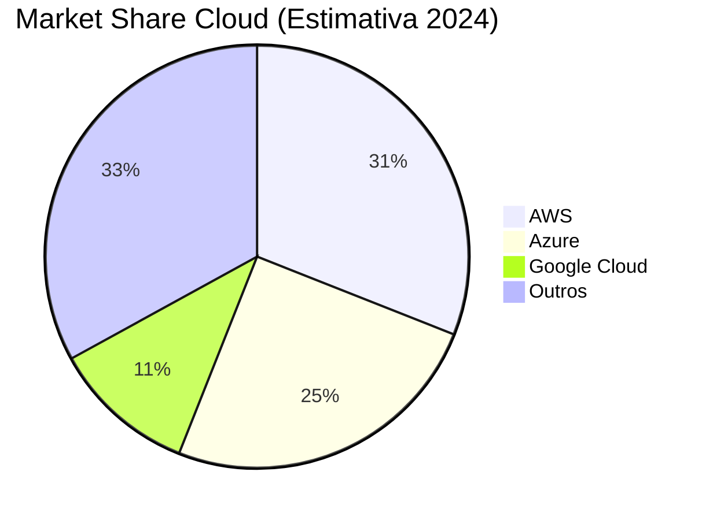

# Aula 10 - Principais Provedores de Cloud (AWS, Azure, GCP) 🏢

!!! tip "Objetivo"
    **Objetivo**: Conhecer os três maiores provedores de computação em nuvem do mundo, entender seus principais serviços e aprender como escolher o melhor para cada projeto.

---

## 1. O Mercado de Cloud 📊

Embora existam dezenas de empresas de nuvem, o mercado é dominado pelo "Big Three": AWS, Microsoft Azure e Google Cloud.

---

## 2. AWS (Amazon Web Services) 🟠

A pioneira e atual líder de mercado. É conhecida por ter a maior variedade de serviços.
*   **Carro-chefe**: **EC2** (Servidores virtuais).
*   **S3**: Armazenamento de arquivos super barato e seguro.
*   **Perfil**: Ideal para empresas que precisam de ferramentas muito específicas e maduras.

---

## 3. Microsoft Azure 🔵

A favorita das grandes empresas que já usam Windows e Office. Integração total com o ecossistema Microsoft.
*   **Carro-chefe**: **Azure App Service**.
*   **Active Directory**: Gerenciamento de usuários e logins empresariais.
*   **Perfil**: Escolha padrão para o mundo corporativo e usuários de .NET.

---

## 4. Google Cloud Platform (GCP) 🔴

Conhecida pela sua excelência em ferramentas de **Dados, Inteligência Artificial e Kubernetes**.
*   **Carro-chefe**: **GKE** (Google Kubernetes Engine).
*   **BigQuery**: Banco de dados para análise de trilhões de linhas em segundos.
*   **Perfil**: Preferida por startups e empresas focadas em inovação e IA.

---

## 5. Comparação de Serviços (Nomes diferentes, mesma função) 🔄

| Função | AWS | Azure | GCP |
| :--- | :--- | :--- | :--- |
| **Servidor CPU** | EC2 | Virtual Machines | Compute Engine |
| **Containers** | ECS / EKS | AKS | GKE |
| **Arquivos** | S3 | Blob Storage | Cloud Storage |
| **Banco SQL** | RDS | Azure SQL | Cloud SQL |
| **Sem Servidor** | Lambda | Azure Functions | Cloud Functions |

---

## 6. Como escolher? 🤔

1.  **Conhecimento Técnico**: Sua equipe já conhece alguma? Comece por ela.
2.  **Tecnologia**: Usa .NET? Vá de Azure. Usa Docker/K8s pesado? Considere GCP. Precisa de tudo e mais um pouco? AWS.
3.  **Localização**: Onde estão seus usuários? Escolha o servidor mais próximo deles (Brasil tem regiões de todas as 3).

### Verificando Latência (Termynal) 💻

ping sa-east-1.amazonaws.com
64 bytes from ... icmp_seq=1 ttl=245 time=15.2 ms
64 bytes from ... icmp_seq=2 ttl=245 time=14.8 ms

Região: São Paulo (Baixa Latência) ✅

---

## 7. Exercício de Fixação 🧠

1.  Se uma empresa usa massivamente o ecossistema Microsoft (Office 365, Active Directory), qual nuvem ela provavelmente escolherá?
2.  Qual serviço da AWS você usaria para guardar as fotos dos usuários do seu app?
3.  O Google Cloud é muito respeitado por qual tipo de tecnologia específica citada na aula?

---

**Próxima Aula**: Como colocamos nosso código lá dentro? [Deploy em Cloud (Simulação e Prática)](./aula-11.md) 🚀
