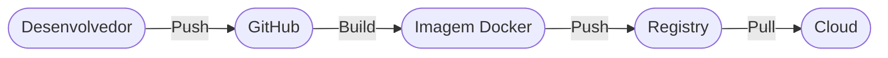

# Aula 11 - Deploy em Cloud (Simulação e Prática) 🚀

!!! tip "Objetivo"
    **Objetivo**: Entender o que acontece "nos bastidores" quando enviamos nosso código para a nuvem e como usar ferramentas de PaaS para fazer o deploy de aplicações Docker de forma simplificada.

---

## 1. O que é Deploy? 📦

Deploy (ou Implantação) é o processo de tirar o seu código da sua máquina de desenvolvimento e colocá-lo em um servidor acessível a todos os usuários via internet.

---

## 2. O Fluxo de Deploy com Docker ⛴️

Quando usamos Docker, o deploy fica muito mais seguro e previsível:

### Simulação de Deploy (Termynal) 💻

docker build -t app:v1 .
Building image... Done
docker push registry.com/app:v1
Pushing [==========>] 100MB/100MB
deploy-to-cloud --image app:v1
Pulling image... OK
Starting container... OK
Status: Aplicação no Ar! 🚀

1.  **Build**: Criamos a imagem da aplicação.
2.  **Push**: Enviamos a imagem para um "cartório" de imagens (Registry).
3.  **Run**: O servidor na nuvem baixa a imagem e inicia o container.

---

## 3. Formas de fazer Deploy na Nuvem 🏗️

Existem diferentes níveis de dificuldade:

*   **Dificuldade Alta (IaaS)**: Você cria uma VM, instala o Docker manualmente, configura o firewall e sobe o container. (EC2, Azure VM).
*   **Dificuldade Média (Managed)**: Você usa um serviço que gerencia os containers para você. (AWS ECS, Google Cloud Run).
*   **Dificuldade Baixa (PaaS)**: Você apenas conecta seu GitHub e a nuvem faz tudo sozinha. (Heroku, Render, Railway).

---

## 4. Prática: Conceito de Serverless Containers ⚡

Serviços como o **Google Cloud Run** ou **AWS Fargate** são o "estado da arte". Você paga apenas pelos segundos em que seu container está sendo usado. Se ninguém acessa o site, o custo é zero!

---

## 5. Variáveis de Ambiente em Produção 🔑

**IMPORTANTE**: Nunca coloque senhas ou chaves de API direto no código ou no Dockerfile.
No deploy em nuvem, usamos as "Environment Variables" (Variaáveis de Ambiente) configuradas no painel do provedor.

---

## 6. Diferença entre Deploy e Release 🏁

*   **Deploy**: O código está no servidor.
*   **Release**: O código está disponível para o usuário final.
Usando ferramentas modernas, podemos fazer o deploy de uma versão nova mas só liberá-la (release) para os usuários depois de testarmos no ambiente real.

---

## 7. Exercício de Fixação 🧠

1.  Qual a vantagem de usar um Registry (como o Docker Hub) no processo de deploy?
2.  Por que o modelo "Serverless" (como Cloud Run) é atraente economicamente para pequenas empresas?
3.  Onde devemos guardar a senha do banco de dados na hora de fazer o deploy na nuvem? No código ou em Variáveis de Ambiente?

---

**Próxima Aula**: Como criar toda essa infraestrutura sem clicar em botões? [Infraestrutura como Código (IaC)](./aula-12.md) 💻
