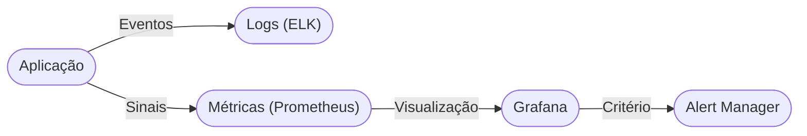

# Aula 13 - Monitoramento e Observabilidade 📊

!!! tip "Objetivo"
    **Objetivo**: Entender a diferença entre Monitoramento e Observabilidade e por que é impossível gerenciar o que você não consegue medir.

---

## 1. Por que monitorar? 🤔

No mundo DevOps, não perguntamos *se* algo vai falhar, mas *quando*. O monitoramento nos permite detectar falhas antes que o cliente perceba.

*   **Disponibilidade**: O site está no ar?
*   **Performance**: O site está rápido ou lento?
*   **Erros**: Quantos erros 500 estamos tendo por minuto?

---

## 2. Monitoramento vs Observabilidade 🔭

*   **Monitoramento**: "O sistema está funcionando?" (Checks de Sim/Não, CPU, Memória). É o "O Quê".
*   **Observabilidade**: "Por que o sistema não está funcionando?" (Logs, Métricas, Tracing). É o "Por Quê".

---

## 3. Os 3 Pilares da Observabilidade 🏛️

3.  **Tracing**: O caminho de uma requisição por vários microserviços. Ferramentas: **Jaeger**, **AWS X-Ray**.

### Fluxo de Observabilidade

### Investigando Métricas (Termynal) 💻

prometheus-query 'up{job="web-server"}'
Métrica: up (status do servidor)
Valor: 1 (Online)
prometheus-query 'http_requests_total{status="500"}'
Valor: 42 (Atenção: Aumento de erros!)
Status: Alerta enviado para o Grafana! 🚨

---

## 4. O que é o Grafana? 🖼️

O Grafana é uma ferramenta de visualização. Ele se conecta ao seu banco de métricas (Prometheus) e transforma números chatos em gráficos lindos e dashboards em tempo real.

---

## 5. Alertas: O grito do servidor 🚨

Não adianta ter gráficos se ninguém olha para eles. Precisamos de alertas automáticos:
*   "Se o erro passar de 5% em 1 minuto, mande um Slack para o time de DevOps."
*   "Se o servidor atingir 90% de disco, abra um chamado no Jira."

---

## 6. Exercício de Fixação 🧠

1.  Explique a diferença entre uma Métrica e um Log.
2.  Por que dashboards de monitoramento costumam ficar em TVs nas salas de TI?
3.  Qual ferramenta você usaria para visualizar gráficos de performance: Grafana ou Elasticsearch?

---

**Próxima Aula**: Como manter tudo isso seguro? [Segurança e DevSecOps](./aula-14.md) 🛡️
