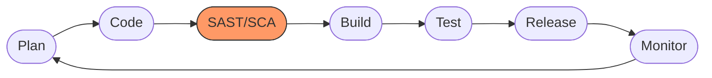

# Aula 14 - Segurança em Cloud e DevSecOps 🛡️

!!! tip "Objetivo"
    **Objetivo**: Entender que a segurança não deve ser a última etapa (Checkpoint), mas sim uma camada presente em todo o ciclo de desenvolvimento (Shift Left).

---

## 1. O Modelo de Responsabilidade Compartilhada 🤝

Na nuvem, a segurança é dividida entre você e o provedor (AWS/Azure/GCP):
*   **Provedor**: Cuida da segurança "DA" nuvem (Data centers físicos, rede, hardware).
*   **Você**: Cuida da segurança "NA" nuvem (Seus dados, suas senhas, suas configurações de firewall).

---

## 2. O que é DevSecOps? 🛡️🔄

É a evolução do DevOps. Significa integrar a segurança desde o primeiro dia do projeto.
*   **Com DevSecOps**: Segurança está em cada commit, em cada build e em cada deploy.

### O Ciclo DevSecOps

### Verificação de Segurança (Termynal) 💻

npm audit
Scanning dependencies...
Found 1 high severity vulnerability
npm audit fix
Fixed 1 vulnerability. 0 vulnerabilities remaining.
Status: Código Seguro para Deploy! 🛡️

---

## 3. Práticas Essenciais de DevSecOps 🛠️

1.  **SAST (Static Application Security Testing)**: Analisa o código fonte em busca de vulnerabilidades antes mesmo dele rodar.
2.  **SCA (Software Composition Analysis)**: Verifica se as bibliotecas que você baixou (npm, pip) têm vulnerabilidades conhecidas.
3.  **Secret Scanning**: Ferramentas que impedem você de subir senhas e chaves de API para o GitHub por acidente.

---

## 4. O Princípio do Menor Privilégio 🔑

Nunca dê permissão total para tudo.
*   **Ruim**: Dar permissão de "ADMIN" para o servidor web.
*   **Bom**: O servidor web só pode ler o banco de dados e escrever na pasta de logs.

---

## 5. Criptografia: Dados em Repouso e em Trânsito 🔐

*   **Em Trânsito**: Use sempre **HTTPS** (TLS). Os dados devem viajar criptografados pela internet.
*   **Em Repouso**: Os dados salvos no banco de dados e nos discos da nuvem também devem estar criptografados.

---

## 6. Exercício de Fixação 🧠

1.  O que significa "Shift Left" na segurança?
2.  No modelo de responsabilidade compartilhada, quem é responsável por garantir que o banco de dados tem uma senha forte?
3.  Qual a diferença entre SAST e SCA?

---

**Próxima Aula**: Conclusão do Curso e Próximos Passos! [Finalização](./index.md) 🎓
