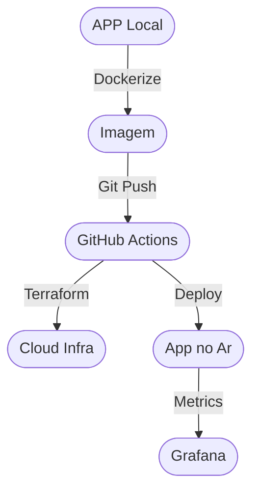

# Aula 15 - Projeto Prático Integrador 🏗️🚀

!!! tip "Objetivo"
    **Objetivo**: Integrar todos os conhecimentos adquiridos (Git, Docker, Cloud, IaC e Monitoramento) para colocar uma aplicação real no ar seguindo as melhores práticas DevOps.

---

## 1. O Desafio: A esteira de produção 🏎️

Ao longo do curso, vimos as peças separadas. Agora, vamos montar o quebra-cabeça. O objetivo é criar o fluxo completo desde o seu computador até a nuvem:

5.  **Monitoramento**: Validar se os logs e métricas estão subindo.

### A Jornada do Projeto

### Orquestrando o Lab Final (Termynal) 💻

git push origin main
Triggering Integration...

Terraform apply: Done (12 resources)
Docker push: Done (v1.0.0)
Cloud Run deploy: Done

Link: https://projeto-final.a.run.app 🚀

---

## 2. Passo 1: O Repositorio 📦

Crie um novo repositório no GitHub. Organize as pastas de forma clara:
*   `/src`: Código da aplicação.
*   `/infra`: Arquivos do Terraform.
*   `/.github/workflows`: Arquivos de CI/CD.
*   `Dockerfile`: Receita do container.

---

## 3. Passo 2: A Automação (CI) 🤖

Configure o GitHub Actions para que, a cada push, ele:
*   Rode os testes unitários.
*   Analise o código com uma ferramenta de **Lint**.
*   Gere a imagem Docker e envie para o **Docker Hub**.

---

## 4. Passo 3: Provisionamento (IaC) 💻

Use o Terraform para criar os recursos necessários na Cloud de sua escolha (AWS/Azure/GCP).
*   Lembre-se de configurar o **State File** em um bucket remoto (S3/Cloud Storage).
*   Não suba senhas para o Git! Use variáveis do GitHub Secrets.

---

## 5. Passo 4: Deploy e Monitoramento 📊

No último passo do seu pipeline de CD, o código deve ser atualizado no servidor.
*   Valide o acesso via URL pública.
*   Acesse o dashboard de monitoramento e veja os gráficos de consumo de CPU aumentarem durante o deploy.

---

## 6. Checkpoint de Entrega ✅

Para considerar seu projeto concluído, responda:
1.  Sua aplicação está rodando via container?
2.  Consigo deletar toda a infraestrutura e recriar com um único comando `terraform apply`?
3.  O deploy acontece automaticamente ao dar `git push` na branch main?

---

**Próxima Aula**: Como entrar neste mercado? [Carreira e Próximos Passos](./aula-16.md) 🏃‍♂️
